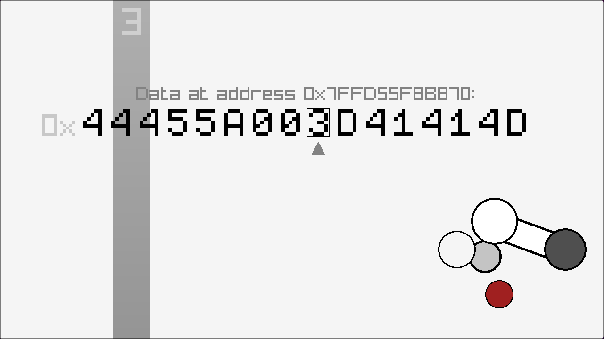

# track oveflow

**A program that turns its own memory into breakcore!**

Specifically, this is a C program that makes a variable (stored on the stack), gets a pointer to it, and keeps reading far past that! It then reads 4 bits at a time, playing the corresponding beat out of the 16 chops of the original break. This project also includes a display (built with [raylib](https://raylib.com)) that shows the data, it's position in memory, and what beat is currently playing!

## Installation

For Windows and Linux users on x86, there are archives in the releases page that include an assets folder and an executable. Extract the archive and run the executable to play. If that's not possible, you can clone the repository with git, get the latest release of raylib on their [github](https://github.com/raysan5/raylib/releases/latest), and compile src/main.c with raylib included/installed to get an executable for your OS and/or architecture.

Once you're in, just turn up your volume and hear the beautiful music! You are likely going to hear a different mix everytime.

> [!WARNING]
> Due to the nature of this program, you very well may encounter a segfault! You can still quit with escape or 'q' at any time before that.
